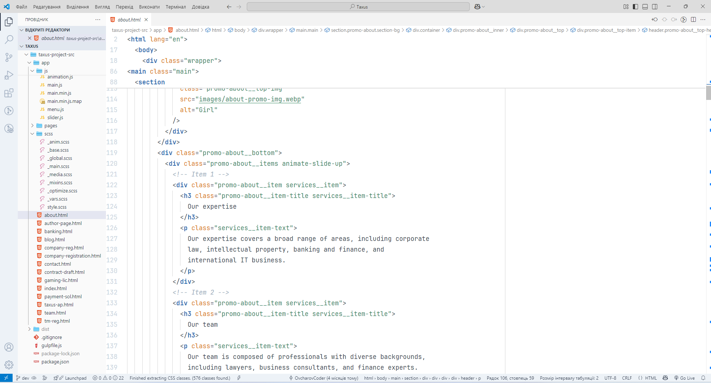
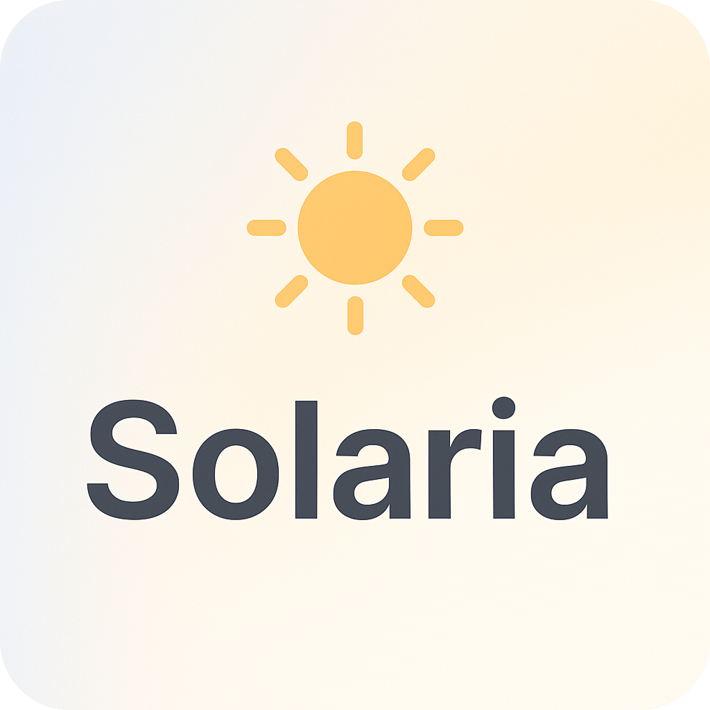

# Solaria Light Theme ☀️

**Solaria Light** is a light theme for VS Code inspired by Nordic minimalism and the Tailwind CSS color palette. It features soft tones that are easy on the eyes while maintaining enough contrast for focused, productive coding.

## Features

- Clear syntax highlighting for JavaScript, PHP, HTML, CSS/SCSS
- Support for Tailwind CSS, Sass, and DOM API support
- Subtle, elegant colors for comments, functions, variables, and keywords

## Preview

---

## Installation

1. Download from the [Marketplace](https://marketplace.visualstudio.com/items?itemName=ovcharovcoder.solaria-light-theme)
2. Select the theme via `Preferences → Color Theme → Solaria Light Theme`

---

## Development Date  
🗓️ Developed: May 2025

---

## Author

- Andriy Ovcharov
- E-mail: datoshcode@gmail.com

---

## Icon

---

## License

MIT

